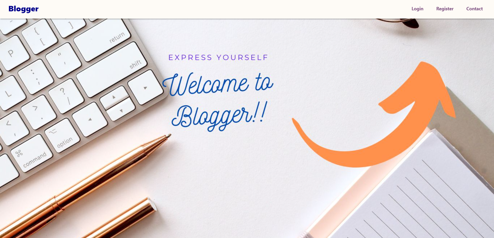
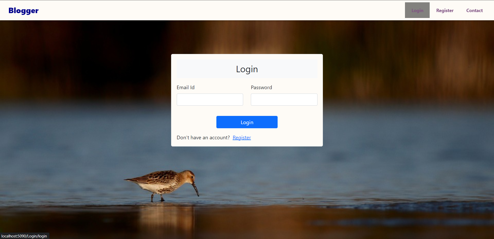
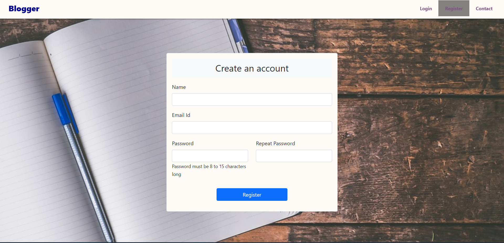
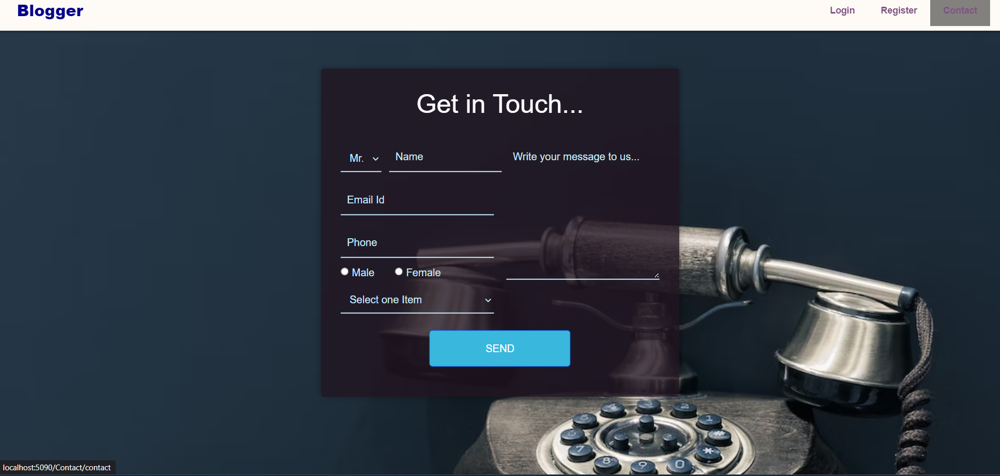
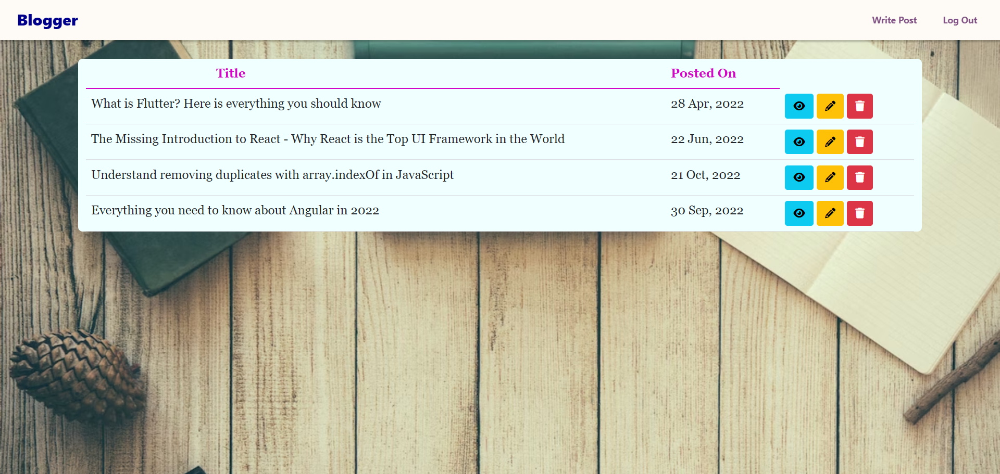
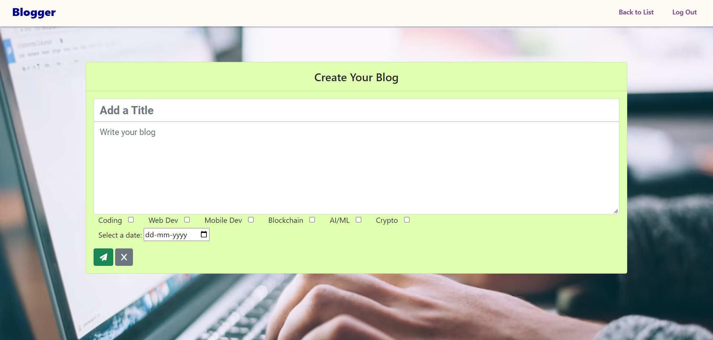
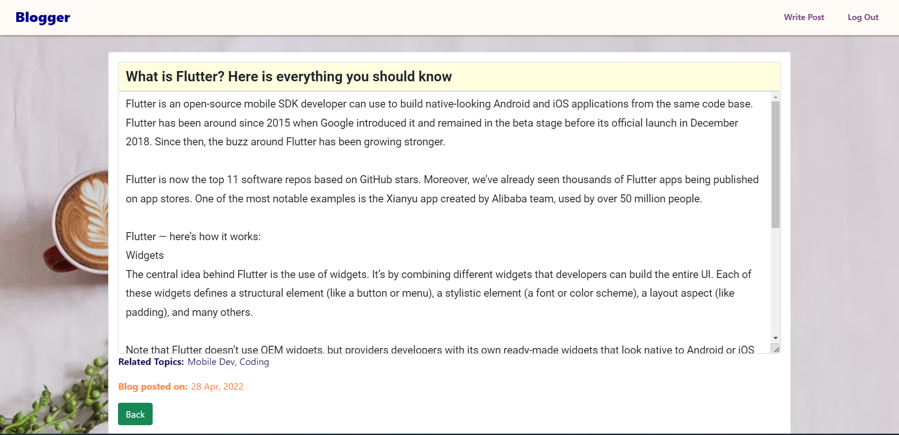

# Blogger

Thank you for checking out this project.

Welome to "Blogger" - a web app for blogging.

This web app is made using Asp.Net Core WebApp (Model-View-Controller).

Do checkout the Angular 14 and Asp.Net Core WebApi version of this project at https://github.com/raghavambashta/Blogging-WebApp-Angular-Asp.Net

## Features:

1. Create user, login and logout
2. SHA-256 password encryption
3. CRUD operations on Blogs
4. Contact page to leave feedback/comments/suggestions
5. Client-side validations on all the forms

## Project Images:

### Landing Page

### Login Page

### Sign Up Page

### Contact Us Page

### Blog Home Page

### Create Blog Page

### Blog View

## Installation

### A) Asp.Net Core Web Api

Just open BloggerMVC.sln in Visual Studio and run the project.

Make sure to edit value of "server" in the appsettings.json.

### B) Database

Open the script file in Sql Server Management Studio and run the script to generate the database.
